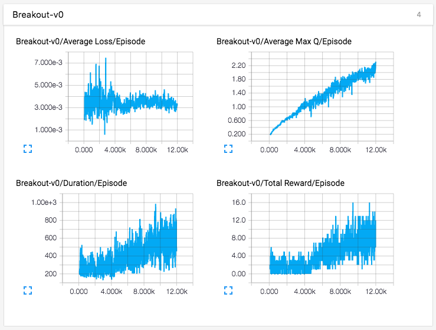

# DQN in Keras + TensorFlow + OpenAI Gym
This is an implementation of DQN (based on [Mnih et al., 2015](http://www.nature.com/nature/journal/v518/n7540/abs/nature14236.html)) in Keras + TensorFlow + OpenAI Gym.  

## Requirements
- gym
- scikit-image
- keras
- tensorflow

## Results
This is the result of training of DQN for about 20 hours(10000 episodes/4.35 millions frames) on AWS EC2 g2.2xlarge instance.  
<br>

<br>
<br>
Statistics of average loss, average max q values, duration and total reward / episode.  
<br>


## Usage
#### Training
For DQN, run:

```
python dqn.py
```

For Double DQN, run:

```
python ddqn.py
```

#### Visualizing learning with TensorBoard
Run the following:

```
tensorboard --logdir=summary/[filename]
```

## Using GPU
I built an AMI for this experiment. All of requirements + CUDA + cuDNN are pre-installed in the AMI.  
The AMI name is `DQN-AMI` and the ID is `ami-c4a969a9`. Feel free to use it.  

## References
- [Playing atari with deep reinforcement learning](http://arxiv.org/pdf/1312.5602.pdf)
- [Human-level control through deep reinforcement learning](http://www.nature.com/nature/journal/v518/n7540/full/nature14236.html)
- [Deep Reinforcement Learning with Double Q-learning](http://arxiv.org/abs/1509.06461)
- [songrotek/DQN-Atari-Tensorflow](https://github.com/songrotek/DQN-Atari-Tensorflow)
- [devsisters/DQN-tensorflow](https://github.com/devsisters/DQN-tensorflow)
- [coreylynch/async-rl](https://github.com/coreylynch/async-rl)
